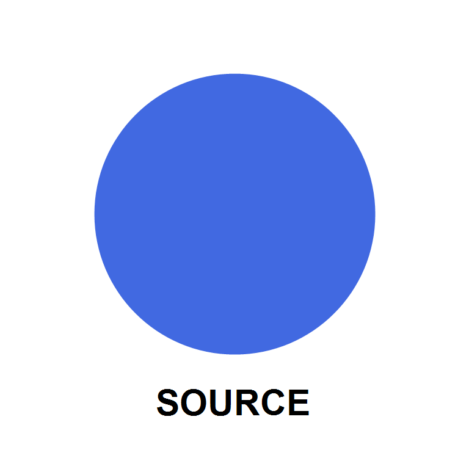
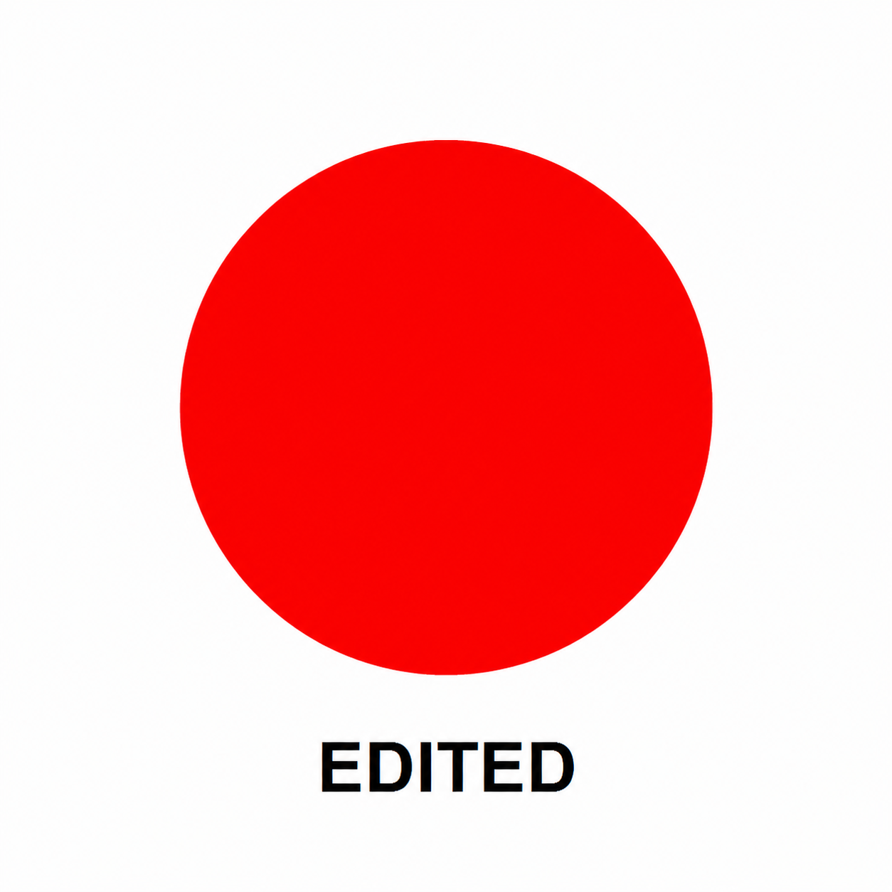

# astrbot_plugin_image2_draw

<div align="center">


Image2 绘图插件。支持在群聊或私聊中使用 `/draw` 文字绘图，也可以附带或回复图片进行参考图修改。

</div>

## 效果演示

### 参考图



### 修改结果



## 功能特点

- 支持 `/draw <提示词>` 文字生成图片。
- 支持同一条消息附图后执行修改。
- 支持回复一张图片后执行修改。
- 使用 OpenAI Chat 兼容的多模态请求，绘图模型名可在 WebUI 自定义。
- 可选调用另一套模型优化文字提示词，不限制模型厂商。
- 支持图片 URL 和 base64 两种绘图响应。
- API Key 只从 AstrBot WebUI 配置读取，不内置任何真实密钥。

## 安装方式

1. 在 AstrBot 插件管理页面上传插件压缩包，或将本仓库放入 AstrBot 插件目录。
2. 打开插件设置，填写绘图 API 地址、API Key 和模型。
3. 在 AstrBot WebUI 中重载插件。
4. 发送 `/draw 一只戴耳机的白猫`，确认插件正常响应。

插件使用 AstrBot 已包含的 `aiohttp`，不需要额外安装依赖。要求 AstrBot `4.24.4` 或更高版本。

## 使用方法

### 文字绘图

```text
/draw 一座建在云海上的未来城市，清晨，电影感光线
```

### 修改同一条消息中的图片

```text
[附带图片] /draw 把背景改成雪夜，保留人物外观和姿势
```

### 修改被回复的图片

回复图片后发送：

```text
/draw 把圆形改成红色，其他内容不变
```

每次只读取一张参考图。同消息图片优先，没有时再读取被回复消息中的图片。

## WebUI 配置

插件提供 `_conf_schema.json`，可在 AstrBot 插件设置页配置：

| 配置项 | 必填 | 说明 |
| --- | --- | --- |
| `image_api_url` | 是 | OpenAI Chat 兼容完整地址，通常以 `/v1/chat/completions` 结尾 |
| `image_api_key` | 是 | 绘图服务 API Key |
| `image_model` | 是 | 绘图模型名，例如 `gpt-image-2` |
| `request_timeout_seconds` | 是 | 单次请求最大等待时间，默认 240 秒，可填写 1 到 3600 |
| `optimize_prompt` | 否 | 是否在绘图前优化文字提示词 |
| `optimizer_api_url` | 开启优化时 | 任意厂商的 OpenAI Chat 兼容完整地址 |
| `optimizer_api_key` | 否 | 优化服务需要鉴权时填写，本地服务可以留空 |
| `optimizer_model` | 开启优化时 | 优化接口支持的模型名，不限制厂商 |

提示词优化只处理文字要求，不读取参考图，也不会猜测图片中没有明确说明的内容。

## 数据与安全

API Key 由 AstrBot 保存到自己的插件配置目录：

```text
data/config/astrbot_plugin_image2_draw_config.json
```

请不要把这个配置文件、真实 API Key 或包含密钥的日志提交到公开仓库。参考图片会发送给你配置的绘图服务，请确认该服务的数据处理规则符合你的使用要求。

单张参考图最大为 20 MB。AstrBot 生成的临时图片文件会由消息事件清理，不会写入插件仓库。

## 常见问题

### 为什么提示“地址返回了网页”？

绘图接口使用 Chat 协议，地址通常应以 `/v1/chat/completions` 结尾。`/v1/generations` 是错误路径，会返回网关网页。

### 为什么提示“响应中没有找到图片”？

检查模型是否确实支持绘图，并确认上游返回了图片 URL、data URL 或 base64 图片数据。

### 优化提示词只能用 OpenAI 模型吗？

不是。模型厂商和模型名不受限制，但填写的接口需要兼容 OpenAI Chat JSON。

### 为什么绘图需要等待几十秒？

图片模型通常比文本模型耗时更长。插件单次请求超时为 240 秒。

## 更新日志

### v1.0.1

- WebUI 不再预填绘图 API 地址和绘图模型。
- 新增单次请求最大等待时间设置，默认 240 秒。
- 配置校验通过后先发送“开始绘画喵”，再等待图片结果。
- 最低兼容版本调整为 AstrBot 4.24.4。

### v1.0.0

- 新增 `/draw` 文字绘图。
- 支持同消息图片和回复图片作为参考图进行修改。
- 支持在 WebUI 配置绘图 API、API Key 和模型。
- 支持使用另一套 OpenAI Chat 兼容模型优化文字提示词。

## 开源说明

本插件只负责转发绘图请求，不提供或代理任何模型额度。请合理使用自己的 API Key，并遵守所配置模型服务的使用规则。
