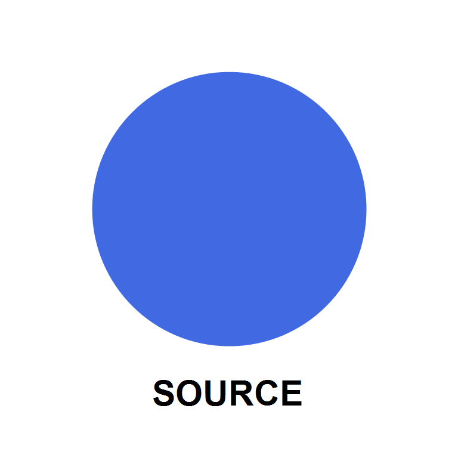
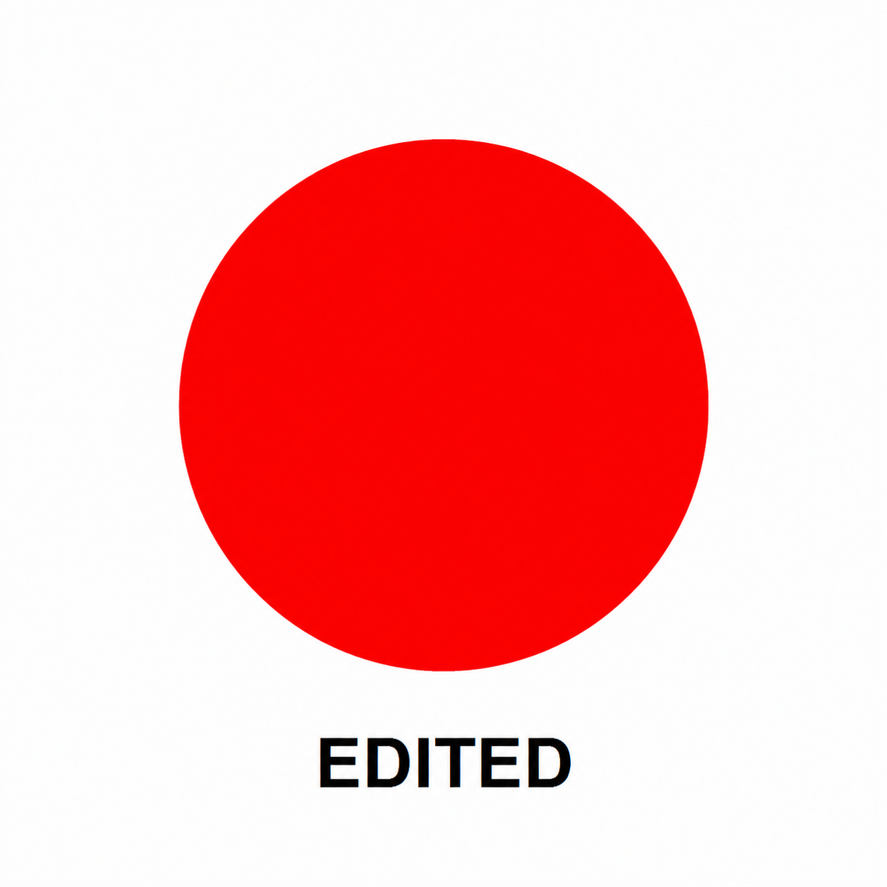

# astrbot_plugin_image2_draw

<div align="center">


Image2 绘图插件。支持在群聊或私聊中使用 `/draw` 文字绘图，也可以附带或回复图片进行参考图修改。

</div>

## 效果演示

### 参考图



### 修改结果



## 功能特点

- 支持 `/draw <提示词>` 文字生成图片。
- 支持同一条消息附图后执行修改。
- 支持回复一张图片后执行修改。
- 支持 OpenAI Chat 和 OpenAI Images 两种绘图请求协议；Images 协议可分别配置生成和编辑端点。
- OpenAI Images 清晰度可选 `1K`、`2K`、`4K`，默认 `4K`。
- 可选调用另一套模型优化文字提示词，不限制模型厂商。
- 支持图片 URL 和 base64 两种绘图响应。
- API Key 只从 AstrBot WebUI 配置读取，不内置任何真实密钥。

## 安装方式

1. 在 AstrBot 插件管理页面上传插件压缩包，或将本仓库放入 AstrBot 插件目录。
2. 打开插件设置，填写绘图 API 地址、API Key 和模型。
3. 在 AstrBot WebUI 中重载插件。
4. 发送 `/draw 一只戴耳机的白猫`，确认插件正常响应。

插件使用 AstrBot 已包含的 `aiohttp`，不需要额外安装依赖。要求 AstrBot `4.24.4` 或更高版本。

## 使用方法

### 文字绘图

```text
/draw 一座建在云海上的未来城市，清晨，电影感光线
```

群聊中可以直接发送 `/draw`，不需要 @机器人。

### 修改同一条消息中的图片

```text
[附带图片] /draw 把背景改成雪夜，保留人物外观和姿势
```

### 修改被回复的图片

回复图片后发送：

```text
/draw 把圆形改成红色，其他内容不变
```

每次只读取一张参考图。同消息图片优先，没有时再读取被回复消息中的图片。

### 优化提示词

```text
/youhua 一座建在云海上的未来城市，清晨，电影感光线
```

机器人会先回复“开始优化喵”，再输出优化后的提示词。这个命令只需要配置优化接口和优化模型，不需要配置绘图接口；即使提示词超过 50 字，也会按你的要求尝试优化。

`/youhua` 不受绘图群白名单和每日绘图次数限制。

## WebUI 配置

插件提供 `_conf_schema.json`，可在 AstrBot 插件设置页配置：

| 配置项 | 必填 | 说明 |
| --- | --- | --- |
| `image_api_url` | 是 | Chat 完整端点，或 Images 的完整 `/v1/images/generations` 端点 |
| `image_edit_api_url` | 使用 Images 参考图编辑时 | Images 的完整 `/v1/images/edits` 端点；只做文字生图可留空 |
| `image_api_protocol` | 是 | `openai_chat` 使用 Chat 请求体；`openai_images` 自动按是否附图选择生成或编辑端点 |
| `image_api_key` | 是 | 绘图服务 API Key |
| `image_model` | 是 | 绘图模型名，例如 `gpt-image-2` |
| `image_resolution` | 是 | Images 生成和编辑使用的清晰度，默认 `4K`；请求值会转换成对应的像素尺寸 |
| `request_timeout_seconds` | 是 | 单次请求最大等待时间，默认 240 秒，可填写 1 到 3600 |
| `draw_retry_count` | 否 | 绘图接口返回 502 或 524 时的重试次数，默认 0，可填写 0 到 3；可能重复生成或计费 |
| `whitelist_groups` | 否 | 可使用 `/draw` 的 QQ 群号；留空允许所有群，私聊不受限制 |
| `daily_draw_limit` | 是 | 每人每天可成功使用 `/draw` 的次数，默认 1；绘图失败会退回次数 |
| `unlimited_users` | 否 | 不受每日次数限制的 QQ 号；仍需遵守群白名单 |
| `optimize_prompt` | 否 | 是否在绘图前优化文字提示词 |
| `optimizer_max_prompt_length` | 否 | 启用优化时，超过该长度自动跳过优化；默认 50，中文每字计 1，0 表示不限制 |
| `optimizer_api_url` | 开启 `/draw` 自动优化或使用 `/youhua` 时 | 任意厂商的完整 OpenAI Chat 端点，插件不会补全或改写路径 |
| `optimizer_api_key` | 否 | 优化服务需要鉴权时填写，本地服务可以留空 |
| `optimizer_model` | 开启 `/draw` 自动优化或使用 `/youhua` 时 | 优化接口支持的模型名，不限制厂商 |

提示词优化只处理文字要求，不读取参考图，也不会猜测图片中没有明确说明的内容。

提示词优化始终使用 Chat 请求体。请按服务商页面给出的完整 Chat 端点填写，例如 `https://api.siliconflow.cn/v1/chat/completions`；插件不会自行补全或改写路径。

绘图协议按服务商后台的“入站协议”或“端点”选择：

```text
入站 /v1/chat/completions -> image_api_protocol = openai_chat
入站 /v1/images/generations -> image_api_protocol = openai_images
```

如果服务商同时提供截图中的两个 Images 端点，请这样填写：

```text
image_api_protocol = openai_images
image_api_url = https://服务商地址/v1/images/generations
image_edit_api_url = https://服务商地址/v1/images/edits
image_resolution = 4K
```

无附图时插件调用 `generations`；同消息附图或回复图片时调用 `edits`。清晰度设置只作用于文字生图，会转换为：`1K -> 1024x1024`、`2K -> 2048x2048`、`4K -> 4096x4096`。参考图编辑由模型自动选择兼容尺寸，避免服务商拒绝不支持的编辑尺寸。

群白名单只限制 `/draw`：不填写 `whitelist_groups` 时所有群都能绘图；填写后只有名单内的群能绘图，私聊始终可用。每日次数按用户 QQ 号统计，跨群与私聊共用，服务器日期变化后自动重置。`unlimited_users` 中的用户不受次数限制，但不能绕过群白名单。

绘图次数保存在用户目录的 `.astrbot_plugin_image2_draw/daily_usage.json`，插件重载或更新不会清空。只有成功生成图片才占用次数；接口报错会退回本次预留。

绘图服务返回 `502` 表示上游通道暂时不可用，`524` 表示上游处理超时，调大本地等待时间并不能保证解决。可按需要设置 `draw_retry_count`，但 `524` 后上游可能仍在生成，自动重试可能产生重复图片或额外计费。

绘图完成或失败时，机器人会引用回复原来的 `/draw` 消息；`/youhua` 的结果和错误也会引用回复原命令。“开始绘画喵”不会引用回复。

插件会要求 Images 接口优先返回 `b64_json`。如果上游仍返回远程图片 URL，插件会在绘图请求结束前下载并校验图片，再交给 AstrBot 发送，避免适配器下载预签名地址超时。

## 数据与安全

API Key 由 AstrBot 保存到自己的插件配置目录：

```text
data/config/astrbot_plugin_image2_draw_config.json
```

请不要把这个配置文件、真实 API Key 或包含密钥的日志提交到公开仓库。参考图片会发送给你配置的绘图服务，请确认该服务的数据处理规则符合你的使用要求。

图片编辑支持 PNG、JPEG 和 WebP 参考图，单张最大为 20 MB。插件会检查实际文件内容，不会只凭网址后缀把网页当成图片上传。AstrBot 生成的临时图片文件会由消息事件清理，不会写入插件仓库。

## 常见问题

### 为什么提示“地址返回了网页”？

插件不会猜测或补全端点。请按服务商页面显示的入站端点填写完整地址：`openai_chat` 通常是 `/v1/chat/completions`，`openai_images` 通常是 `/v1/images/generations`。优化接口始终使用 Chat 协议。插件不支持 OpenAI Responses 请求体。

### 为什么提示“响应中没有找到图片”？

请先更新到 `v1.0.13`。新版能够读取放在 `result`、`image` 和对象形式 `data` 中的图片。如果接口用 HTTP 200 包装了 `error`，插件会显示经过脱敏的真实错误原因；其他无图片响应只显示安全的字段名和任务状态，不会显示提示词、任务 ID、API Key 或图片 base64。

### 为什么生成成功却没有发出图片？

旧版本会把上游返回的远程 URL 直接交给 AstrBot。服务器访问 S3 等图片存储超时时，日志会停在 `Prepare to send`，随后出现 `download_image_by_url` 的 `TimeoutError`。`v1.0.8` 起会优先请求 `b64_json`，并在必要时由插件先下载图片再发送。

### 为什么附图修改返回 HTTP 400？

请先更新到 `v1.0.11`。旧版本会把文字生图的清晰度参数直接用于图片编辑，部分模型会因此拒绝请求。新版会使用单张参考图格式上传，并让编辑模型自动选择兼容尺寸。参考图需要是 PNG、JPEG 或 WebP。

### 优化提示词只能用 OpenAI 模型吗？

不是。模型厂商和模型名不受限制，但填写的接口需要兼容 OpenAI Chat JSON。

### 为什么绘图需要等待几十秒？

图片模型通常比文本模型耗时更长。插件单次请求超时为 240 秒。

## 更新日志

### v1.0.13

- 修复接口用 HTTP 200 返回 `error` 时只显示“没有找到图片”的问题，现在会显示经过脱敏的真实错误原因。

### v1.0.12

- 修复接口已经生成图片，却因响应外层结构不同而误报“没有找到图片”的问题。
- 支持更多常见的图片结果结构，包括嵌套结果和对象形式的数据。
- 接口没有返回图片时，会显示安全的响应字段与任务状态，方便继续排查。

### v1.0.11

- 修复附带或回复图片进行修改时，图片编辑接口可能返回 HTTP 400 的问题。
- 参考图编辑改为由模型选择兼容尺寸，文字生图的清晰度设置保持不变。
- 已使用真实 JPG 和在线编辑接口验证，能够正常返回修改后的图片。

### v1.0.10

- 加强参考图读取检查，避免把错误网页误当成图片上传。
- 图片编辑遇到不支持的格式时，会在请求前给出清楚提示。

### v1.0.9

- 修复 Images 清晰度参数：`1K`、`2K`、`4K` 分别转换为 `1024x1024`、`2048x2048`、`4096x4096`。
- 生成和编辑接口统一使用转换后的像素尺寸。

### v1.0.8

- `openai_images` 支持分别配置 `/v1/images/generations` 和 `/v1/images/edits`，自动区分文字生图与参考图编辑。
- 新增图片清晰度设置，支持 `1K`、`2K`、`4K`，默认 `4K`。
- Images 请求优先返回 `b64_json`；远程 URL 会先下载并校验，再以 base64 交给 AstrBot 发送。

### v1.0.7

- 群聊中的 `/draw` 和 `/youhua` 不再要求 @机器人即可识别。

### v1.0.6

- 新增 `/draw` QQ 群白名单，留空时允许所有群，私聊不受限制。
- 新增每人每日绘图次数，默认 1 次；失败会退回次数，个人白名单用户无限次。
- `/youhua` 不受群白名单和每日次数限制。
- 每日次数持久保存，插件重载或更新后仍然有效。

### v1.0.5

- 新增 `openai_images` 绘图协议，适配 `/v1/images/generations` 的 `model + prompt` 请求体。
- WebUI 明确提示按服务商页面的入站端点填写，插件不再自动补全或改写地址。
- `openai_images` 在附图时会在开始绘画前提示切换协议，避免发送错误请求。

### v1.0.4

- `/youhua` 在优化服务配置校验通过后，会先回复“开始优化喵”。

### v1.0.3

- 新增 `/youhua <提示词>`，显式调用优化模型并输出优化后的提示词。
- `/youhua` 仅依赖优化接口配置，不受 `/draw` 自动优化开关和 50 字跳过阈值影响。
- 绘图和优化接口会在请求前校验地址格式。

### v1.0.2

- 新增 `draw_retry_count`：可选重试绘图接口的 HTTP `502` 和 `524`，默认关闭，最多 3 次。
- 新增 `optimizer_max_prompt_length`：提示词超过默认 50 字时跳过优化，减少额外模型调用。
- 绘图结果和错误提示会引用回复触发它的 `/draw` 消息。

### v1.0.1

- WebUI 不再预填绘图 API 地址和绘图模型。
- 新增单次请求最大等待时间设置，默认 240 秒。
- 配置校验通过后先发送“开始绘画喵”，再等待图片结果。
- 最低兼容版本调整为 AstrBot 4.24.4。

### v1.0.0

- 新增 `/draw` 文字绘图。
- 支持同消息图片和回复图片作为参考图进行修改。
- 支持在 WebUI 配置绘图 API、API Key 和模型。
- 支持使用另一套 OpenAI Chat 兼容模型优化文字提示词。

## 开源说明

本插件只负责转发绘图请求，不提供或代理任何模型额度。请合理使用自己的 API Key，并遵守所配置模型服务的使用规则。
